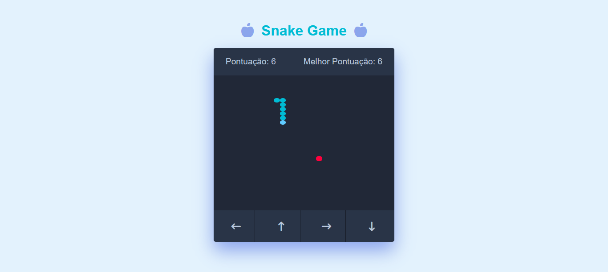

# 🐍 **Jogo da Cobrinha**

Este é um projeto de **Jogo da Cobrinha** (Snake Game) desenvolvido em **HTML**, **CSS** e **JavaScript**. O jogo desafia o jogador a controlar uma cobra enquanto coleta comida, cresce e tenta evitar bater nas paredes ou em seu próprio corpo. O objetivo é alcançar a maior pontuação possível.

## 📋 **Funcionalidades**

- **Pontuação em Tempo Real**: A pontuação do jogador é exibida e atualizada conforme ele coleta comida.
- **Melhor Pontuação**: O jogo registra e exibe a melhor pontuação de todos os tempos, armazenando-a no **localStorage**.
- **Controles Visuais**: O jogador pode controlar a cobra usando as teclas de seta ou os botões visuais na interface.
- **Reiniciar Jogo**: O jogo oferece a opção de reiniciar a partida após a derrota.
- **Design Responsivo**: A interface do jogo se adapta a diferentes tamanhos de tela.

## 🚀 **Como Jogar**

1. **Iniciar o Jogo**:
   - O jogo começa automaticamente quando a página é carregada.
   - A cobra pode ser controlada pelas teclas de seta ou pelos botões visuais na parte inferior da tela.

2. **Movimentação**:
   - A cobra se move na direção das teclas pressionadas ou dos botões clicados. Evite bater nas paredes ou no corpo da cobra.

3. **Coletar Comida**:
   - A cobra cresce e a pontuação aumenta sempre que ela come a comida, que aparece em posições aleatórias.

4. **Fim de Jogo**:
   - O jogo termina quando a cobra bate nas paredes ou em si mesma.
   - Uma mensagem será exibida, e você pode reiniciar o jogo ao recarregar a página.

5. **Melhor Pontuação**:
   - A melhor pontuação alcançada será salva e exibida no topo da tela.

6. **Reiniciar Jogo**:
   - Ao terminar, você pode recarregar a página para reiniciar o jogo.

## 🛠️ **Tecnologias Utilizadas**

- **HTML**: Estrutura básica do jogo.
- **CSS**: Estilização do jogo e design responsivo.
- **JavaScript**: Lógica do jogo, manipulação de eventos e DOM.
- **Font Awesome**: Ícones para a interface.
- **localStorage**: Armazenamento da melhor pontuação.

## 🖼️ **Prévia**



## 📦 **Como Executar o Projeto**

### 1. Clone o repositório:

```bash
git clone https://github.com/eduardomarcolin09/SnakeGame.git
```

### 2. Acesse a pasta do projeto:

```bash
cd SnakeGame
```

### 3. Abra o arquivo index.html em um navegador.

## 📝 **Melhorias Futuras**

- Adicionar níveis de dificuldade com diferentes tamanhos de tabuleiro.
- Implementar cronômetro para limitar o tempo de cada jogada.
- Exibir histórico de pontuações ao final de cada partida.

## 📚 **Notas Finais**

- Este projeto foi desenvolvido como uma prática de programação e é aberto a sugestões e melhorias.
- Caso encontre algum bug ou comportamento inesperado, sinta-se à vontade para abrir uma issue no repositório.
- O Jogo da Cobrinha foi projetado para ser simples e divertido, com foco no aprendizado de manipulação de DOM e lógica em JavaScript.
- **Divirta-se jogando e explorando o código! 😊**